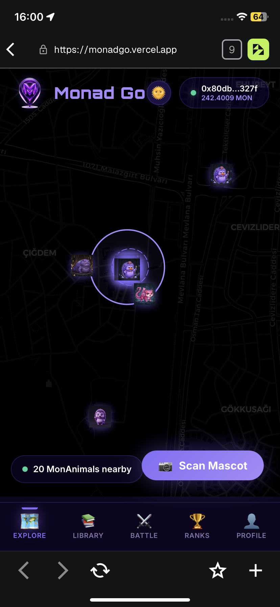
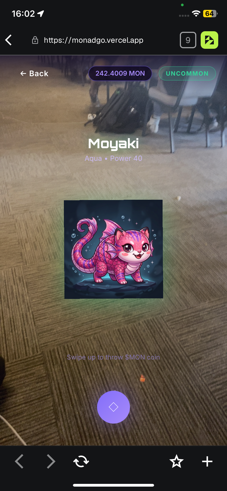
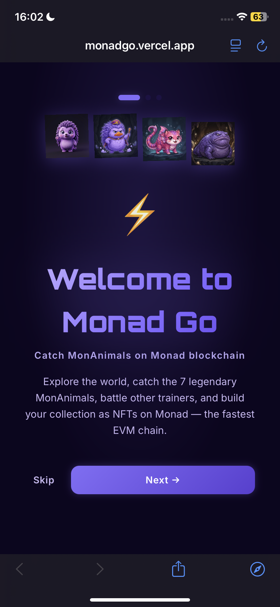
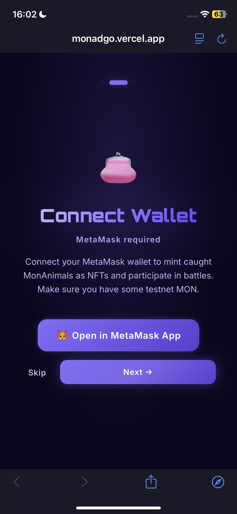

<div align="center">
  
  <h1>🎮 Monad Go</h1>
  <p><b>Gotta Catch 'em All on Monad! A location-based Web3 monster-catching AR game.</b></p>
  <p>Built for the <b>Ankara Hackathon</b> ⚡</p>

  <div>
    
    
    
    
  </div>
</div>

<br/>

## 🌟 The Vision

**Monad Go** bridges the gap between Web3 and the physical world. Inspired by the cultural phenomenon of Pokémon GO, we created a game where players explore their real-life surroundings to hunt, catch, and collect **MonAnimals** as NFTs on the **Monad blockchain**.

Why Monad? Because real-time AR gaming requires **instant micro-transactions**. Every time a player throws a coin to catch a MonAnimal, they send `0.01 MON` to the treasury. On traditional chains, this would ruin the gameplay loop. On Monad, the extreme throughput and sub-second finality make blockchain interactions feel entirely frictionless.

---

## 🔥 Key Features

- 🌍 **Real-World Map Exploration:** Using HTML5 Geolocation and `Leaflet.js`, players navigate a stylized map synced with their physical location. MonAnimals spawn dynamically in a 2km radius!
- 📸 **Augmented Reality (AR) Catching:** We tap into the device's Camera and Gyroscope (`DeviceOrientationEvent`). Move your phone physically to aim at the MonAnimal!
- 🪙 **Physics-Based Coin Throwing:** Swipe up to throw a Monad Coin! The trajectory, speed, and 3D wobble are calculated in real-time based on your swipe velocity.
- ⚡ **Frictionless Micro-Transactions:** Catching costs `0.01 MON`. The transaction confirms in milliseconds, allowing the game to proceed instantly.
- 🎒 **NFT Collection & Power-Ups:** Catching duplicates doesn't waste them—it powers up your existing MonAnimal!
- 🚀 **Viral Social Quests:** Connect your X (Twitter) account and share your catches to earn bonus scores. Plus, a built-in QR Code generator lets presenters onboard audiences instantly during pitches!

---

## 📱 Visual Walkthrough

Here is the complete user journey of Monad Go, from onboarding to building your ultimate collection:

<table>
  <tr>
    <td align="center">
      
      <br/><b>1. Onboarding & Wallet</b><br/>Players must connect their Web3 wallet. Local data is isolated per wallet address!
    </td>
    <td align="center">
      
      <br/><b>2. Sensor Permissions</b><br/>We request Camera, GPS, and Gyroscope access to enable the AR experience.
    </td>
    <td align="center">
      
      <br/><b>3. Map Exploration</b><br/>Real-time GPS tracking. MonAnimals spawn dynamically around your location.
    </td>
  </tr>
  <tr>
    <td align="center">
      
      <br/><b>4. AR Catch Phase</b><br/>Use your physical camera and tilt your phone to find the MonAnimal.
    </td>
    <td align="center">
      
      <br/><b>5. Throwing the Coin</b><br/>Swipe up to throw! Costs 0.01 MON. Powered by frictionless Monad txs.
    </td>
    <td align="center">
      
      <br/><b>6. Catch Result</b><br/>Did it escape, or did you catch it? Catch chances increase upon failure!
    </td>
  </tr>
  <tr>
    <td align="center">
      
      <br/><b>7. The Collection</b><br/>Your personal Pokedex! View stats, rarity, and power levels of your NFTs.
    </td>
    <td align="center">
      
      <br/><b>8. Player Profile</b><br/>Track total catches, your MON balance, and your overall trainer score.
    </td>
    <td align="center">
      
      <br/><b>9. Social Quests</b><br/>Connect and share on X (Twitter) to earn +20 bonus score points.
    </td>
  </tr>
  <tr>
    <td align="center">
      
      <br/><b>10. Hackathon Ready</b><br/>Custom UI designed to look sleek, neon, and totally Web3 native.
    </td>
    <td align="center">
      
      <br/><b>11. Multi-tenant</b><br/>Log out and log in with a new wallet, and get a fresh new account instantly.
    </td>
    <td align="center">
      
      <br/><b>12. Viral QR Sharing</b><br/>Share the DApp directly from your phone to onboard friends!
    </td>
  </tr>
</table>

---

## 🛠️ Architecture & Tech Stack

- **Frontend:** React.js powered by Vite for blazing fast HMR.
- **Styling:** Custom CSS modules utilizing a unified Design System (Neon Purple / Cyberpunk aesthetic). No heavy component libraries, ensuring maximum performance on mobile.
- **State Management:** Custom React Hooks (`useGameState`) handling complex isolated states for different wallet addresses.
- **Web3 Provider:** `ethers.js` connected directly to the Monad RPC for signing transactions.
- **Maps:** `react-leaflet` with CartoDB Dark Matter tiles for that sleek dark-mode look.
- **AR Engine:** Native browser APIs (`navigator.mediaDevices`, `DeviceOrientationEvent`) manipulated via React refs and inline CSS 3D Transforms for a lightweight, dependency-free AR engine!

---

## 🚀 How to Run Locally

1. Clone the repository:
```bash
git clone https://github.com/hsankc/NadGO.git
```

2. Install dependencies:
```bash
npm install
```

3. Run the development server:
```bash
npm run dev
```

*⚠️ **Important for Local Mobile Testing:** The Camera and Gyroscope APIs require a Secure Context (HTTPS). If testing on your mobile phone via local network, you must use a tunneling service like [localtunnel](https://localtunnel.me/) or `ngrok`.*

```bash
npx localtunnel --port 5173
```

---
<div align="center">
  <i>Developed with 💜 for the Monad Ecosystem.</i>
</div>
