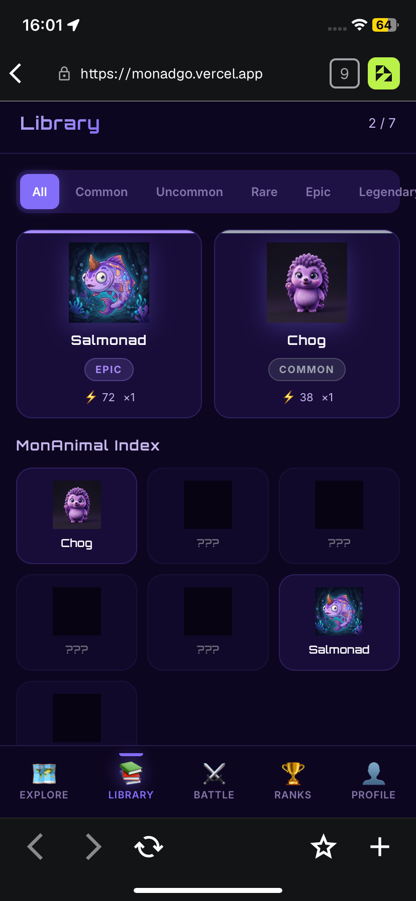
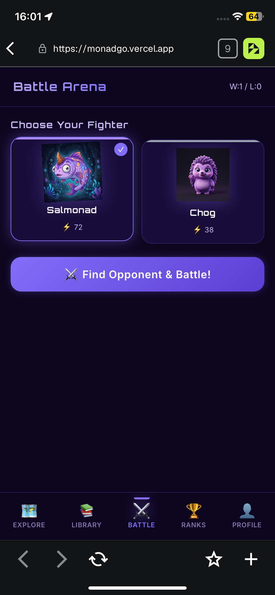
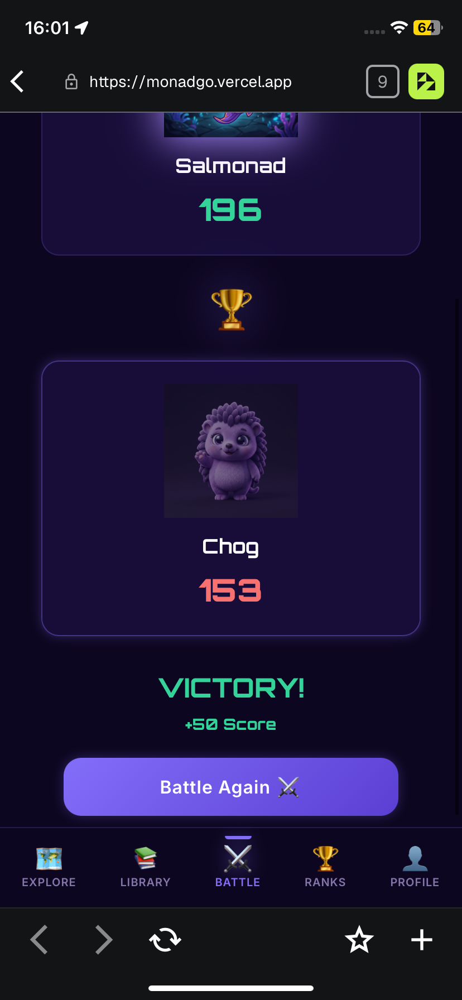
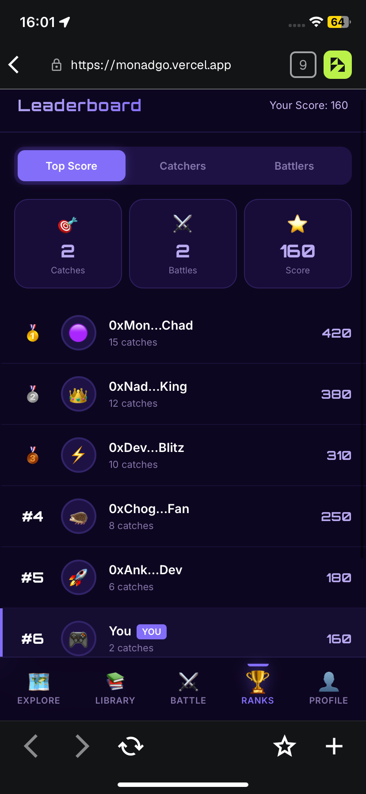
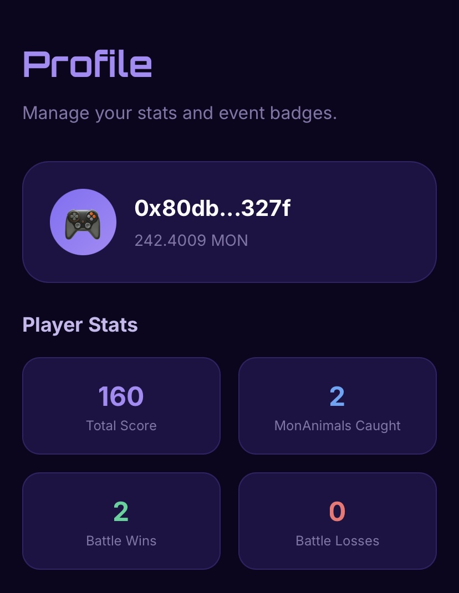
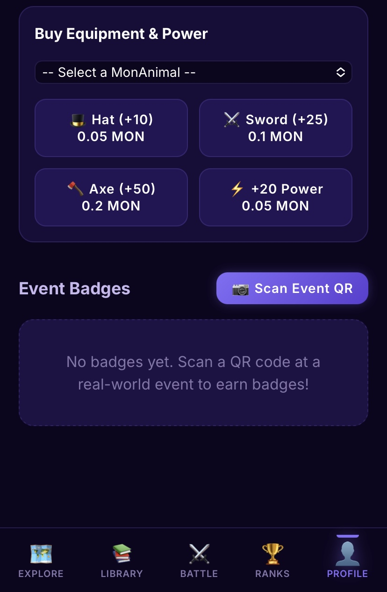
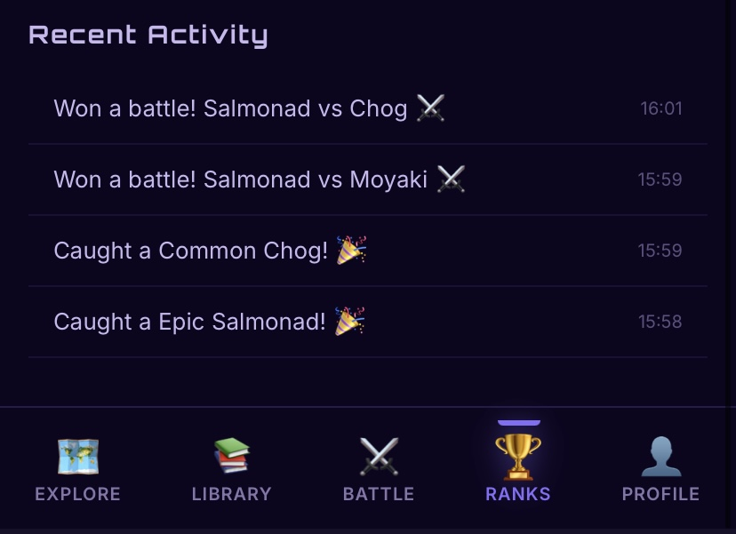
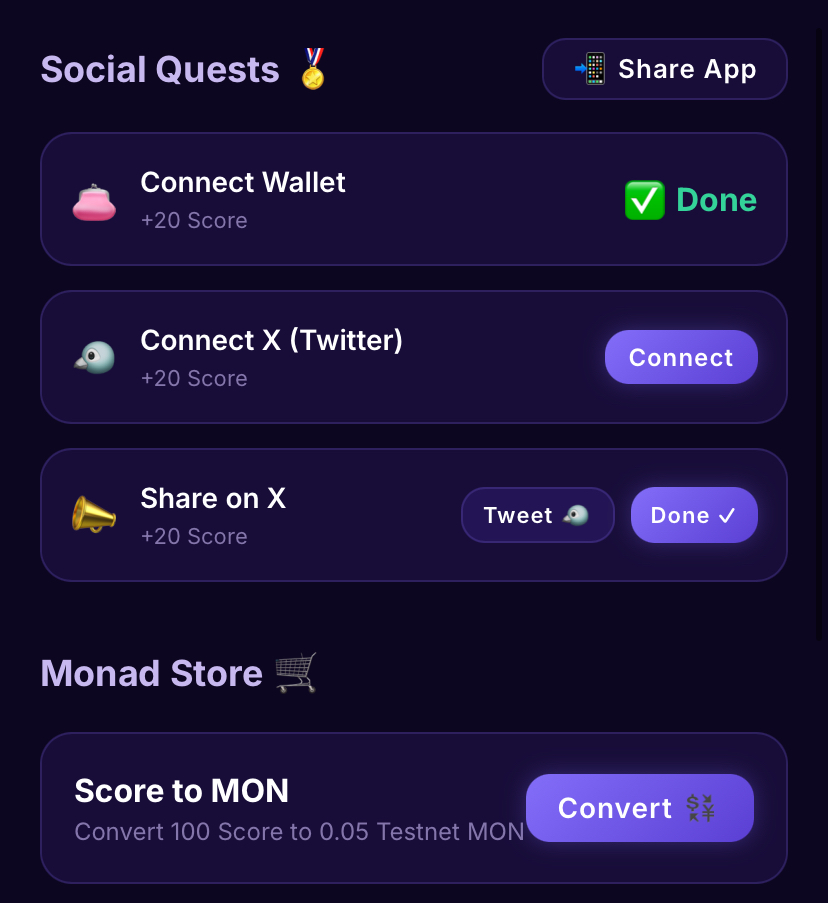

<div align="center">
  
  <h1>🎮 Monad Go</h1>
  <p><b>Gotta Catch 'em All on Monad! The Future of Location-Based Web3 AR Gaming.</b></p>
  <p>Built exclusively for the <b>Ankara Hackathon</b> ⚡</p>

  <div>
    <p style="font-size: 18px;"><b>🟢 Play Live Now:</b> <a href="https://monadgo.vercel.app/">https://monadgo.vercel.app/</a></p>
    <a href="https://monadgo.vercel.app/" target="_blank">
      
    </a>
  </div>
  <br/>
  <p><b>🏆 Hackathon Category:</b> GameFi / Web3 Gaming & AR</p>
  <div>
    
    
    
    
  </div>
</div>

<br/>

## 🌌 The Vision: Revolutionizing Web3 Gaming on Monad

For years, Web3 gaming has struggled with a massive bottleneck: **Friction**. Traditional blockchains are too slow and too expensive to support real-time, micro-interaction gaming. Players don't want to wait 15 seconds for a transaction to clear just to throw an item or take a step in a game.

**Enter Monad Go.**

We are bridging the gap between the physical world and the digital Web3 ecosystem. Inspired by the cultural phenomenon of Pokémon GO, we created a game where players actually have to step outside, explore their physical surroundings using GPS, hunt down legendary **MonAnimals**, and battle other trainers!

### ⚡ Why Monad? (The Ecosystem Impact)
**Monad Go** is a love letter to the Monad ecosystem. It showcases exactly why Monad's architecture is a game-changer:
1. **Instant Micro-Transactions:** In Monad Go, *every single time* a player throws a coin to catch a monster, an on-chain transaction of `0.01 MON` is executed. On any other EVM chain, this would completely ruin the immersion. On Monad, the extreme parallel execution and sub-second finality make the transaction feel **instant**.
2. **Mass Onboarding (SocialFi):** By integrating viral quests and real-world event QR scanning, Monad Go is designed to be an onboarding funnel. It brings non-crypto natives into the Monad ecosystem through the universal appeal of gaming.
3. **True Ownership & Economy:** Every caught MonAnimal is yours. Buy equipment (swords, hats), battle others, and convert your hard-earned Trainer Score back into testnet MON!

---

## 📸 Step-by-Step Interactive Walkthrough

We have meticulously crafted every screen of Monad Go to provide a AAA mobile experience in the browser. Here is the complete journey of a player, step by step:

### 1. The Gateway (Welcome & Lore)
<div align="center">
  
</div>
When a user opens Monad Go, they are greeted with a sleek, cyberpunk-inspired onboarding flow. This screen introduces the 7 Legendary MonAnimals and sets the ultimate goal: Catch, Battle, and Collect on the fastest EVM chain.

<br/>

### 2. Web3 Identity (Connect Wallet)
<div align="center">
  
</div>
We enforce a strict Web3-first approach. Players must connect their MetaMask to start minting caught MonAnimals.
*Technical Flex:* The app uses the wallet address to strictly isolate local storage data, meaning multiple users can play on the exact same physical device seamlessly.

<br/>

### 3. The Monad World Map (Explore)
<div align="center">
  
</div>
The core exploration hub. Powered by real-time GPS tracking, players see themselves on a stylized dark-mode map of the real world. A radar pulses around you, showing exactly which MonAnimals are within catching distance. Time to walk!

<br/>

### 4. AR Catch Mode (Micro-Transaction Physics)
<div align="center">
  
</div>
Once a player taps a nearby MonAnimal, they enter AR Catch Mode. Using the device's camera, the monster appears in the real world. Players swipe up to physically throw a Monad Coin. At the exact moment of the throw, a `0.01 MON` transaction is executed instantly!

<br/>

### 5. Your NFT Pokedex (Library)
<div align="center">
  
</div>
A gorgeous, tabbed grid of your hard-earned assets. MonAnimals are sorted by rarity (Common, Uncommon, Rare, Epic, Legendary). You can see undiscovered silhouettes in the MonAnimal Index, driving the urge to "catch 'em all".

<br/>

### 6. The Battle Arena (Choose Your Fighter)
<div align="center">
  
</div>
It's not just about collecting—it's about dominance. In the Battle Arena, players select their strongest MonAnimal (based on Base Power) to go head-to-head against other trainers on the network.

<br/>

### 7. Sweet Victory (Battle Result)
<div align="center">
  
</div>
The adrenaline rush of a win! Defeating an opponent grants you massive Trainer Score boosts (+50 Score). The more you battle, the higher you climb.

<br/>

### 8. Global Leaderboard (Ranks)
<div align="center">
  
</div>
Compete globally! The leaderboard tracks the top wallets based on Total Score, Catches, and Battles Won. Do you have what it takes to be the #1 Monad Trainer?

<br/>

### 9. Player Profile & Stats
<div align="center">
  
</div>
The command center. View your connected Wallet Address, live MON balance, Total Score, MonAnimals Caught, and your Battle Win/Loss ratio. 

<br/>

### 10. The Monad Store & Equipment
<div align="center">
  
</div>
Spend your MON to upgrade your MonAnimals! Buy Hats (+10 Power), Swords (+25 Power), or raw Energy (+20 Power) using lightning-fast micro-transactions. This is where the in-game economy truly shines.

<br/>

### 11. Recent Activity Feed
<div align="center">
  
</div>
A beautiful, scrollable log of your entire journey. Track exactly when you won battles, when you caught that Epic Salmonad, and what power-ups you purchased.

<br/>

### 12. SocialFi Quests & Score Conversion
<div align="center">
  
</div>
We built viral marketing directly into the game. Complete "Social Quests" (like connecting X/Twitter or tweeting about the game) to earn bonus scores. Even better? Convert your hard-earned in-game Score directly back into Testnet MON!

---

## 🛠️ Deep Dive: Architecture & Tech Stack

We refused to compromise on performance. Monad Go is built to be as fast as the blockchain it runs on.

- **Frontend:** React.js powered by Vite for blazing fast performance and HMR.
- **Styling:** Custom CSS modules utilizing a unified Design System (Neon Purple / Cyberpunk aesthetic). We avoided heavy UI libraries to ensure smooth 60fps rendering on mobile devices.
- **State Management:** A custom, highly complex `useGameState` React Hook that handles multi-tenant states. It automatically switches contexts based on the injected `wallet.address`.
- **Web3 Integration:** `ethers.js` connected directly to the Monad RPC.
- **Map Engine:** `react-leaflet` with custom CartoDB Dark Matter tiles.
- **Custom AR Engine:** Instead of heavy WebXR polyfills, we built a lightweight, dependency-free AR engine using native browser APIs (`navigator.mediaDevices`, `DeviceOrientationEvent`) and inline CSS 3D Transforms.

---

## 🚀 How to Run Locally

Want to test the magic yourself?

1. Clone the repository:
```bash
git clone https://github.com/hsankc/MonadGO.git
```

2. Install dependencies:
```bash
npm install
```

3. Run the development server:
```bash
npm run dev
```

*⚠️ **Important for Local Mobile Testing:** The Camera and Gyroscope APIs require a Secure Context (HTTPS). If testing on your mobile phone via your local network, you must use a tunneling service like [localtunnel](https://localtunnel.me/) or `ngrok`.*

```bash
npx localtunnel --port 5173
```

---
<div align="center">
  <i>Developed with 💜 for the Monad Ecosystem. We are ready to onboard the next billion users.</i>
</div>
